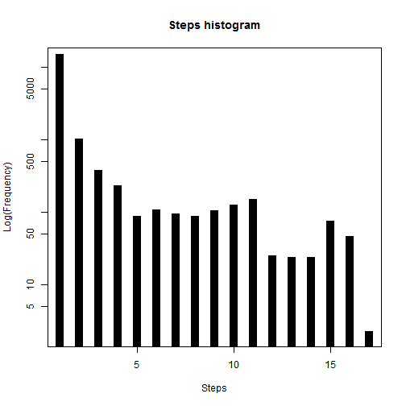
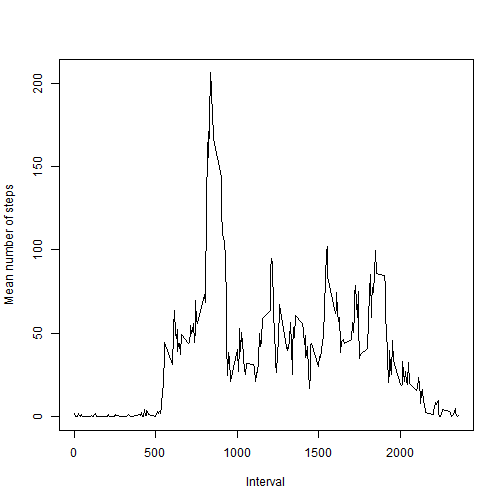
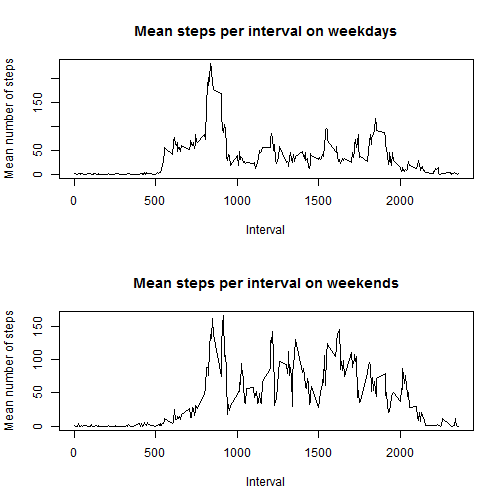

# Reproducible Research: Peer Assessment 1


## Loading and preprocessing the data

```r
data <- read.table(unz("activity.zip", "activity.csv"),header=T,sep=",")
head(data)
```

```
##   steps       date interval
## 1    NA 2012-10-01        0
## 2    NA 2012-10-01        5
## 3    NA 2012-10-01       10
## 4    NA 2012-10-01       15
## 5    NA 2012-10-01       20
## 6    NA 2012-10-01       25
```

## What is mean total number of steps taken per day?
Histogram of the number of steps per day
Log scale is used as otherwise the large number o 0 value would render this
plot useless

```r
my_hist = hist(data$steps, plot=FALSE)
plot(my_hist$counts,log="y",type='h',lwd=10,lend=2,ylab="Log(Frequency)"
     ,xlab="Steps",main="Steps histogram")
```

 
  
Mean of the number of steps per day

```r
steps_mean <- aggregate(data$steps,by=list(data$date),FUN=mean,na.rm = TRUE)
colnames(steps_mean) <- c("Date","Mean of Steps")
steps_mean
```

```
##          Date Mean of Steps
## 1  2012-10-01           NaN
## 2  2012-10-02        0.4375
## 3  2012-10-03       39.4167
## 4  2012-10-04       42.0694
## 5  2012-10-05       46.1597
## 6  2012-10-06       53.5417
## 7  2012-10-07       38.2465
## 8  2012-10-08           NaN
## 9  2012-10-09       44.4826
## 10 2012-10-10       34.3750
## 11 2012-10-11       35.7778
## 12 2012-10-12       60.3542
## 13 2012-10-13       43.1458
## 14 2012-10-14       52.4236
## 15 2012-10-15       35.2049
## 16 2012-10-16       52.3750
## 17 2012-10-17       46.7083
## 18 2012-10-18       34.9167
## 19 2012-10-19       41.0729
## 20 2012-10-20       36.0938
## 21 2012-10-21       30.6285
## 22 2012-10-22       46.7361
## 23 2012-10-23       30.9653
## 24 2012-10-24       29.0104
## 25 2012-10-25        8.6528
## 26 2012-10-26       23.5347
## 27 2012-10-27       35.1354
## 28 2012-10-28       39.7847
## 29 2012-10-29       17.4236
## 30 2012-10-30       34.0938
## 31 2012-10-31       53.5208
## 32 2012-11-01           NaN
## 33 2012-11-02       36.8056
## 34 2012-11-03       36.7049
## 35 2012-11-04           NaN
## 36 2012-11-05       36.2465
## 37 2012-11-06       28.9375
## 38 2012-11-07       44.7326
## 39 2012-11-08       11.1771
## 40 2012-11-09           NaN
## 41 2012-11-10           NaN
## 42 2012-11-11       43.7778
## 43 2012-11-12       37.3785
## 44 2012-11-13       25.4722
## 45 2012-11-14           NaN
## 46 2012-11-15        0.1424
## 47 2012-11-16       18.8924
## 48 2012-11-17       49.7882
## 49 2012-11-18       52.4653
## 50 2012-11-19       30.6979
## 51 2012-11-20       15.5278
## 52 2012-11-21       44.3993
## 53 2012-11-22       70.9271
## 54 2012-11-23       73.5903
## 55 2012-11-24       50.2708
## 56 2012-11-25       41.0903
## 57 2012-11-26       38.7569
## 58 2012-11-27       47.3819
## 59 2012-11-28       35.3576
## 60 2012-11-29       24.4688
## 61 2012-11-30           NaN
```

Median of the number of steps per day

```r
steps_median <- aggregate(data$steps,by=list(data$date),FUN=median,na.rm = TRUE)
colnames(steps_median) <- c("Date","Median of Steps")
steps_median
```

```
##          Date Median of Steps
## 1  2012-10-01              NA
## 2  2012-10-02               0
## 3  2012-10-03               0
## 4  2012-10-04               0
## 5  2012-10-05               0
## 6  2012-10-06               0
## 7  2012-10-07               0
## 8  2012-10-08              NA
## 9  2012-10-09               0
## 10 2012-10-10               0
## 11 2012-10-11               0
## 12 2012-10-12               0
## 13 2012-10-13               0
## 14 2012-10-14               0
## 15 2012-10-15               0
## 16 2012-10-16               0
## 17 2012-10-17               0
## 18 2012-10-18               0
## 19 2012-10-19               0
## 20 2012-10-20               0
## 21 2012-10-21               0
## 22 2012-10-22               0
## 23 2012-10-23               0
## 24 2012-10-24               0
## 25 2012-10-25               0
## 26 2012-10-26               0
## 27 2012-10-27               0
## 28 2012-10-28               0
## 29 2012-10-29               0
## 30 2012-10-30               0
## 31 2012-10-31               0
## 32 2012-11-01              NA
## 33 2012-11-02               0
## 34 2012-11-03               0
## 35 2012-11-04              NA
## 36 2012-11-05               0
## 37 2012-11-06               0
## 38 2012-11-07               0
## 39 2012-11-08               0
## 40 2012-11-09              NA
## 41 2012-11-10              NA
## 42 2012-11-11               0
## 43 2012-11-12               0
## 44 2012-11-13               0
## 45 2012-11-14              NA
## 46 2012-11-15               0
## 47 2012-11-16               0
## 48 2012-11-17               0
## 49 2012-11-18               0
## 50 2012-11-19               0
## 51 2012-11-20               0
## 52 2012-11-21               0
## 53 2012-11-22               0
## 54 2012-11-23               0
## 55 2012-11-24               0
## 56 2012-11-25               0
## 57 2012-11-26               0
## 58 2012-11-27               0
## 59 2012-11-28               0
## 60 2012-11-29               0
## 61 2012-11-30              NA
```

## What is the average daily activity pattern?

Plot of interval and average number of steps across all days

```r
steps_by_int <- aggregate(data$steps,by=list(data$interval),FUN=mean,na.rm = TRUE)
plot(steps_by_int, type="l",xlab="Interval",ylab="Mean number of steps")
```

 

Interval with maximum number of steps on average across all days in dataset

```r
max_steps <- max(steps_by_int[2])
max_interval <- steps_by_int[(steps_by_int[2]==max_steps),1]
```
Interval number with highest average number of steps is 835

## Imputing missing values

Calculate missing values in dataset

```r
numNAs <- nrow(data[is.na(data),])
```
Total number of NAs in the dataset : 2304


We will use the mean for the 5 minute interval across days to fill NA values
This strategy was selected since there are several days with all NA values, so 
picking the mean for each day to fill its own NA values is not possible

```r
filled_data <- data
colnames(steps_by_int) <- c("interval","stepsmean")
for(id in 1:nrow(steps_by_int)) {
    filled_data$steps[ is.na(filled_data$steps) 
                       & filled_data$interval %in% steps_by_int$interval[id] ] <- round(steps_by_int$stepsmean[id])
}
```

Histogram of the number of steps per day for dataset with no NAs

```r
my_hist = hist(filled_data$steps, plot=FALSE)
plot(my_hist$counts,log="y",type='h',lwd=10,lend=2,ylab="Log(Frequency)"
     ,xlab="Steps",main="Steps histogram")
```

 
  
Mean of the number of steps per day for dataset with no NAs

```r
steps_mean <- aggregate(filled_data$steps,by=list(filled_data$date),FUN=mean)
colnames(steps_mean) <- c("Date","Mean of Steps")
steps_mean
```

```
##          Date Mean of Steps
## 1  2012-10-01       37.3681
## 2  2012-10-02        0.4375
## 3  2012-10-03       39.4167
## 4  2012-10-04       42.0694
## 5  2012-10-05       46.1597
## 6  2012-10-06       53.5417
## 7  2012-10-07       38.2465
## 8  2012-10-08       37.3681
## 9  2012-10-09       44.4826
## 10 2012-10-10       34.3750
## 11 2012-10-11       35.7778
## 12 2012-10-12       60.3542
## 13 2012-10-13       43.1458
## 14 2012-10-14       52.4236
## 15 2012-10-15       35.2049
## 16 2012-10-16       52.3750
## 17 2012-10-17       46.7083
## 18 2012-10-18       34.9167
## 19 2012-10-19       41.0729
## 20 2012-10-20       36.0938
## 21 2012-10-21       30.6285
## 22 2012-10-22       46.7361
## 23 2012-10-23       30.9653
## 24 2012-10-24       29.0104
## 25 2012-10-25        8.6528
## 26 2012-10-26       23.5347
## 27 2012-10-27       35.1354
## 28 2012-10-28       39.7847
## 29 2012-10-29       17.4236
## 30 2012-10-30       34.0938
## 31 2012-10-31       53.5208
## 32 2012-11-01       37.3681
## 33 2012-11-02       36.8056
## 34 2012-11-03       36.7049
## 35 2012-11-04       37.3681
## 36 2012-11-05       36.2465
## 37 2012-11-06       28.9375
## 38 2012-11-07       44.7326
## 39 2012-11-08       11.1771
## 40 2012-11-09       37.3681
## 41 2012-11-10       37.3681
## 42 2012-11-11       43.7778
## 43 2012-11-12       37.3785
## 44 2012-11-13       25.4722
## 45 2012-11-14       37.3681
## 46 2012-11-15        0.1424
## 47 2012-11-16       18.8924
## 48 2012-11-17       49.7882
## 49 2012-11-18       52.4653
## 50 2012-11-19       30.6979
## 51 2012-11-20       15.5278
## 52 2012-11-21       44.3993
## 53 2012-11-22       70.9271
## 54 2012-11-23       73.5903
## 55 2012-11-24       50.2708
## 56 2012-11-25       41.0903
## 57 2012-11-26       38.7569
## 58 2012-11-27       47.3819
## 59 2012-11-28       35.3576
## 60 2012-11-29       24.4688
## 61 2012-11-30       37.3681
```

Median of the number of steps per day for dataset with no NAs

```r
steps_median <- aggregate(filled_data$steps,by=list(filled_data$date),FUN=median)
colnames(steps_median) <- c("Date","Median of Steps")
steps_median
```

```
##          Date Median of Steps
## 1  2012-10-01            34.5
## 2  2012-10-02             0.0
## 3  2012-10-03             0.0
## 4  2012-10-04             0.0
## 5  2012-10-05             0.0
## 6  2012-10-06             0.0
## 7  2012-10-07             0.0
## 8  2012-10-08            34.5
## 9  2012-10-09             0.0
## 10 2012-10-10             0.0
## 11 2012-10-11             0.0
## 12 2012-10-12             0.0
## 13 2012-10-13             0.0
## 14 2012-10-14             0.0
## 15 2012-10-15             0.0
## 16 2012-10-16             0.0
## 17 2012-10-17             0.0
## 18 2012-10-18             0.0
## 19 2012-10-19             0.0
## 20 2012-10-20             0.0
## 21 2012-10-21             0.0
## 22 2012-10-22             0.0
## 23 2012-10-23             0.0
## 24 2012-10-24             0.0
## 25 2012-10-25             0.0
## 26 2012-10-26             0.0
## 27 2012-10-27             0.0
## 28 2012-10-28             0.0
## 29 2012-10-29             0.0
## 30 2012-10-30             0.0
## 31 2012-10-31             0.0
## 32 2012-11-01            34.5
## 33 2012-11-02             0.0
## 34 2012-11-03             0.0
## 35 2012-11-04            34.5
## 36 2012-11-05             0.0
## 37 2012-11-06             0.0
## 38 2012-11-07             0.0
## 39 2012-11-08             0.0
## 40 2012-11-09            34.5
## 41 2012-11-10            34.5
## 42 2012-11-11             0.0
## 43 2012-11-12             0.0
## 44 2012-11-13             0.0
## 45 2012-11-14            34.5
## 46 2012-11-15             0.0
## 47 2012-11-16             0.0
## 48 2012-11-17             0.0
## 49 2012-11-18             0.0
## 50 2012-11-19             0.0
## 51 2012-11-20             0.0
## 52 2012-11-21             0.0
## 53 2012-11-22             0.0
## 54 2012-11-23             0.0
## 55 2012-11-24             0.0
## 56 2012-11-25             0.0
## 57 2012-11-26             0.0
## 58 2012-11-27             0.0
## 59 2012-11-28             0.0
## 60 2012-11-29             0.0
## 61 2012-11-30            34.5
```


As most NAs were restricted to certain days for which there was no data at all, the impact of this changes for other days is small. There are, however, some non-zero medians now, which, due to the way in which the missing data was imputed, represent the median of the averages for each interval across all days. This provides some insightful information.

## Are there differences in activity patterns between weekdays and weekends?

First a new factor variable is created with levels "weekday" and "weekend" based
on date data

```r
testday <- function(n){
    
    x <- as.POSIXlt(as.Date(n))$wday
    if (x==0 | x ==6)
        0
    else 
        1
    
}
days = sapply(as.Date(filled_data$date),testday)
day_factor = factor(days, levels=c(0,1), labels=c("weekend","weekday") )
summary(day_factor)
```

```
## weekend weekday 
##    4608   12960
```
Now bind it to the existing dataset with no NAs

```r
filled_data <- cbind(filled_data,day_factor)
colnames(filled_data)[4] <- "day_type"
summary(filled_data)
```

```
##      steps               date          interval       day_type    
##  Min.   :  0.0   2012-10-01:  288   Min.   :   0   weekend: 4608  
##  1st Qu.:  0.0   2012-10-02:  288   1st Qu.: 589   weekday:12960  
##  Median :  0.0   2012-10-03:  288   Median :1178                  
##  Mean   : 37.4   2012-10-04:  288   Mean   :1178                  
##  3rd Qu.: 27.0   2012-10-05:  288   3rd Qu.:1766                  
##  Max.   :806.0   2012-10-06:  288   Max.   :2355                  
##                  (Other)   :15840
```
Generate the series by type of days for plotting

```r
weekdays_data <- filled_data[filled_data$day_type == "weekday",]
weekdaysteps_by_int <- aggregate(weekdays_data$steps,by=list(weekdays_data$interval),FUN=mean)

weekends_data <- filled_data[filled_data$day_type == "weekend",]
weekendsteps_by_int <- aggregate(weekends_data$steps,by=list(weekends_data$interval),FUN=mean)
```


Plot comparing activity levels between weekdays and weekends

```r
par(mfrow=c(2,1))

plot(weekdaysteps_by_int,type="l",xlab="Interval",ylab="Mean number of steps",main="Mean steps per interval on weekdays")
plot(weekendsteps_by_int,type="l",xlab="Interval",ylab="Mean number of steps",main="Mean steps per interval on weekends")
```

 

This just resets drawing parameters

```r
par(mfrow=c(1,1))
```
